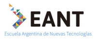

# LatinR 2018

LatinR 2018 fue el 4 y 5 de septiembre de 2018

## Coordinación General y Ejecutiva de las 47 JAIIO

  - Alejandra Garrido
      - Coordinación General de las 47 JAIIO
      - LIFIA-UNLP, CONICET
  - Claudio Zamoszczyk
      - Coordinación General de las 47 JAIIO
      - Universidad de Palermo
  - Alejandra Villa
      - Coordinación Ejecutiva de las 47 JAIIO
      - SADIO

## Chairs LatinR

  - Laura Ación
      - CONICET-UBA
      - Instituto Universitario del Hospital Italiano
      - Fundación Sadosky
      - R-Ladies Buenos Aires, Argentina
  - Natalia da Silva
      - Instituto de Estadística, Facultad de Ciencias Económicas y de
        Administración, Universidad de la República
      - R-Ladies Montevideo, Uruguay
  - Riva Quiroga
      - Facultad de Letras, Universidad Católica de Chile
      - R-Ladies Santiago, Chile

## Comité Científico

  - Marcela Alfaro Córdoba (Universidad de Costa Rica, Costa Rica)
  - Ignacio Álvarez-Castro (Universidad de la República-IESTA, Uruguay)
  - Luis Argerich (Universidad de Buenos Aires, Argentina)
  - Stephan Arndt (University of Iowa, Estados Unidos)
  - Lucas Bali (Universidad de Buenos Aires, Argentina)
  - Ana Bianco (CONICET-Universidad de Buenos Aires, Argentina)
  - Mathias Bourel (Universidad de la República-IESTA-FING, Uruguay)
  - Xavier Buenaño (Universidad Politécnica de Madrid, ETSI Ingenieros
    de Minas y Energía, España)
  - Inés Caridi (CONICET-Universidad de Buenos Aires, Argentina)
  - Ariel Chernomoretz (CONICET-Fundación Instituto Leloir, Argentina)
  - Elena Chicaiza (Instituto Panamericano de Geografía e Historia,
    Ecuador)
  - Marina Cock (CONICET-La Pampa, Argentina)
  - Mario Cortina Borja (University College London, Reino Unido)
  - Gustavo Denicolay (Universidad Austral, Argentina)
  - Carlos Diuk (Facebook, USA)
  - Andrés Farall (Universidad de Buenos Aires, EcoClimaSol, Argentina)
  - María Inés Fariello (Universidad de la República-FING & Instituto
    Pasteur de Montevideo, Uruguay)
  - Ileana Frasier (CONICET-INTA - La Pampa, Argentina)
  - María José García Zattera (Pontificia Universidad Católica de Chile,
    Chile)
  - Juan José Goyeneche (Universidad de la República-IESTA, Uruguay)
  - Erin LeDell (H2O.ai, Estados Unidos)
  - Leandro Lombardi (CONICET-Universidad de Buenos Aires, Fundación
    Sadosky, Argentina)
  - Diana Kelmansky (Universidad de Buenos Aires, Argentina)
  - Estefanía Mancini (Centre for Genomic Regulation, España)
  - Priscilla Minotti (3iA-UNSAM, Argentina)
  - Monica Mendes (Universidade Federal de Campina Grande, Brasil)
  - Leonardo Moreno (Universidad de la República-IESTA, Uruguay)
  - Ricardo Olea (Pontificia Universidad Católica de Chile, Chile)
  - Adriana Pérez (Universidad de Buenos Aires, Argentina)
  - Marcelo Risk (CONICET-Universidad de Buenos Aires, Argentina)
  - Cecilia Ruz (Universidad de Buenos Aires, Argentina)
  - Marcelo Soria (CONICET-Universidad de Buenos Aires, Argentina)
  - Walter Sosa Escudero (CONICET-Universidad de San Andrés, Argentina)
  - Lucía Spangenberg (Instituto Pasteur Montevideo, Uruguay)
  - Nicolás Stier Moses (Facebook, Estados Unidos; Universidad Torcuato
    Di Tella, Argentina)
  - Daniel Yankelevich (Practia, Argentina)

## Comité Organizador

  - Mónica Alonso
      - Banco Ciudad
      - R-Ladies Buenos Aires, Argentina
  - Yanina Bellini Saibene
      - INTA
      - R-Ladies Santa Rosa, Argentina
  - Elio Campitelli
      - Universidad de Buenos Aires, Argentina
  - Paola Corrales
      - Universidad de Buenos Aires, Argentina
      - R-Ladies Buenos Aires, Argentina
  - Maria Florencia D’Andrea
      - CONICET-INTA
      - R-Ladies Buenos Aires, Argentina
  - Gabriela de Queiroz
      - SelfScore
      - R-Ladies Global y San Francisco, EEUU
  - Flavia Fernández
      - Diseñadora Gráfica, UBA
  - Fabiana Flores
      - INTI
      - R-Ladies Buenos Aires, Argentina
  - Lourdes Milagros Mendoza Villavicencio
      - UFRN
      - R-Ladies Natal, Brasil
  - Iara Passos
      - UFRGS
      - R-Ladies Porto Alegre, Brasil
  - Celina Rebello
      - R-Ladies Rio de Janeiro, Brasil)
  - Gabriela Sandoval
      - Pontificia Universidad Católica de Chile
      - R-Ladies Santiago, Chile
  - Daniela Vázquez
      - Idatha
      - R-Ladies Montevideo, Uruguay
  - Luis Darcy Verde Arregoitia
      - UNAM, México
      - Universidad Austral de Chile, Chile
  - Melina Vidoni
      - INGAR CONICET-UTN, Santa Fe, Argentina
      - R-Ladies Buenos Aires
      - Organizadora de R-Ladies Santa Fe
  - Andrea María Lagomarsino
      - INTA

## Con apoyo de 

### Sponsors

### Auspicios

